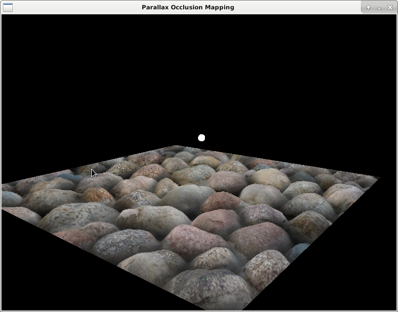
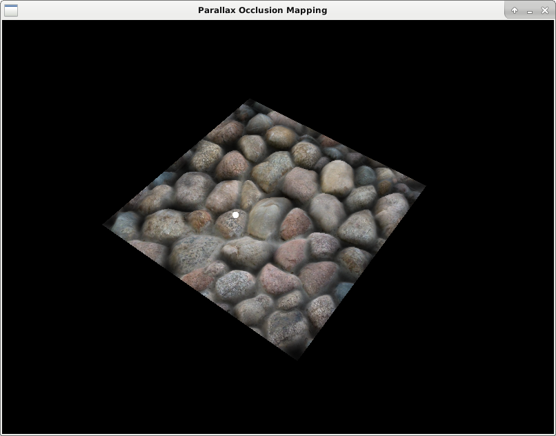
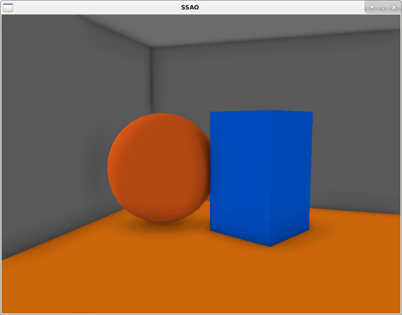
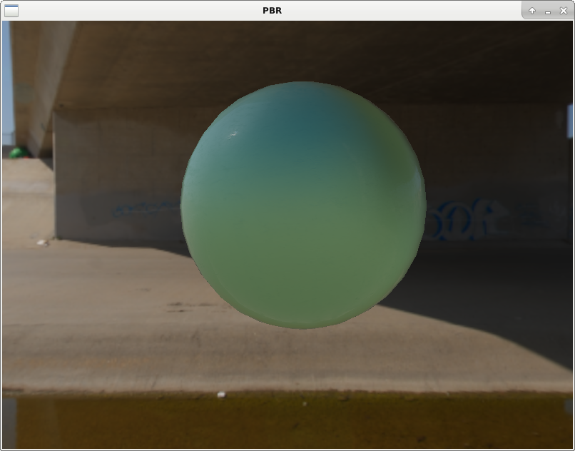
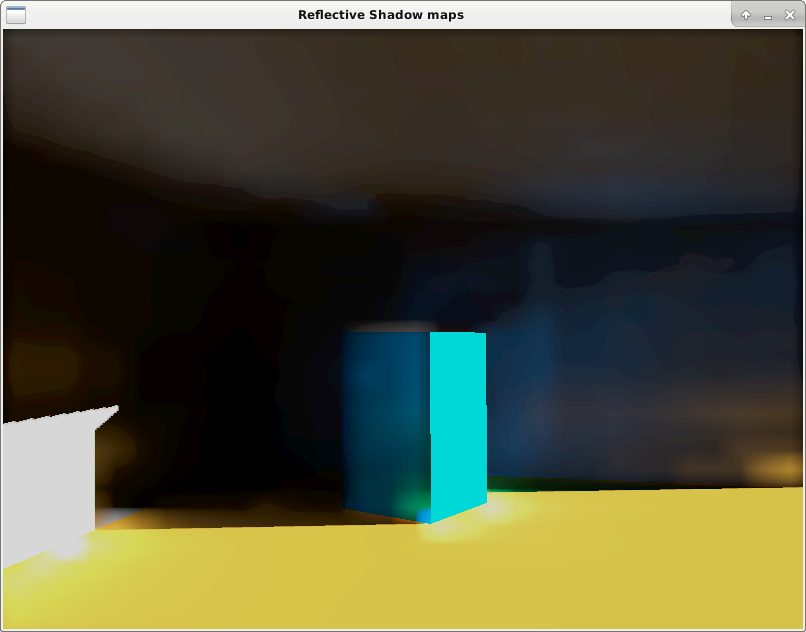

# Set of OpenGL demos

## Parallax Occlusion Mapping
(with soft shadows)

According to http://sunandblackcat.com/tipFullView.php?topicid=28




## Screen Space Ambient Occlusion

According to https://learnopengl.com/Advanced-Lighting/SSAO



## Physically Based Rendering

According to https://learnopengl.com/PBR/Theory



Environment cubemaps were taken from [sIBL archive](http://www.hdrlabs.com/sibl/archive.html).
PBR materials were taken from [FreePBR.com](https://freepbr.com/).

## Reflective Shadow Maps
According to this paper http://www.klayge.org/material/3_12/GI/rsm.pdf

I have not implemented final interpolation step (with recalculation of
global illumination at edges), as described in the paper.
Instead I simply interpolated illumination from low-res texture for
whole screen. This leads to blurry halos around the objects.



# Setting up

This project requires OpenGL, SDL2, GLEW, OpenGL Mathematics
and Cmake to be installed in your system. Once there, use cmake to generate a project
for your favorite IDE. In case of unix systems and `make` building should be as simple as

```bash
mkdir build
cd ./build
cmake ..
make
```

This will generate binaries for all subprojects in corresponding subfolders
insinde `bin` folder.

Note that shaders code placed straight inside `bin/<project_name>` for simplicity.

Keep in mind that depending on your version of `cmake` and/or different versions of "find" modules libraries path constant name may change a bit. For example, some versions finding sdl to `SDL2_LIBRARY` and `SDL2_INCLUDE_DIR` while others use `SDL3_LIBRARIES` and `SDL2_INCLUDE_DIR.
